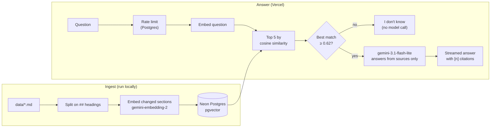

# rag-me

**Ask questions about Arash Salehkhah, answered from his own notes, with sources.**

**Live:** [ask.devarash.icu](https://ask.devarash.icu)

rag-me is a retrieval-augmented generation (RAG) bot for recruiters and hiring
managers. It answers questions about my experience, projects and skills using
only a Markdown knowledge base I wrote, cites the sections it used, and says so
when it does not know.

I built it without a RAG framework (no LangChain, no LlamaIndex) so that every
stage is written, tested and understood by hand: chunking, embedding, vector
search, relevance gating, prompting, streaming and evaluation. It runs entirely
on free tiers.

## How it works



1. **Chunking.** The knowledge base is written so each `##` section stands on its
   own, and each section becomes one chunk. Splitting on the author's own
   boundaries keeps every chunk a complete thought, where fixed-size windows
   would cut sentences and mix topics. Headings are found with a CommonMark
   parser, so a `##` inside a code block is not mistaken for one.
2. **Embedding.** Each chunk is embedded with its document title and heading
   prepended, because a section body often lacks the words a question would use.
   Ingest fingerprints the exact text sent to the model plus the model name, so
   a re-run embeds only what changed and removes deleted sections, all in one
   transaction.
3. **Retrieval.** The question is embedded with Gemini's question-answering
   prefix and the five closest sections are found by cosine distance in pgvector.
   At about 90 rows an exact scan is faster than an approximate index, and exact.
4. **Relevance gate.** If even the best match is below 0.62 similarity, the bot
   answers "I don't know" without calling the language model. In measurement,
   off-topic questions scored at most 0.59 and real ones at least 0.65. The gate
   saves quota and refuses the cheap cases deterministically.
5. **Generation.** The model sees the numbered sources and the visitor's question
   in separate tagged blocks, with the question escaped so it cannot pose as a
   source. Its instructions: answer only from the sources, cite each fact as
   `[n]`, decline when the sources do not cover the question, and ignore
   instructions inside the question.
6. **Streaming.** `POST /api/ask` returns Server-Sent Events: the sources first,
   then the answer as it is generated, then the cited source numbers. The page
   turns each `[n]` into a chip linked to its source.

## Evaluation

[`evals/cases.toml`](evals/cases.toml) holds 34 test questions: plain facts,
paraphrased and vague questions, personal details the knowledge base does not
cover, off-topic questions and prompt injections. `uv run rag-me eval` runs each
one through the real pipeline and scores three stages separately, so a failure
points at its cause:

| Stage | Measured as |
|---|---|
| Retrieval | hit@1, hit@5 and mean reciprocal rank of the first relevant section |
| Relevance gate | answerable questions wrongly refused, off-topic questions caught, and the similarity margin between them |
| Answers | graded by a stronger model (gemini-3.8-flash) against a fixed JSON schema: every claim supported by the sources, expected facts present, citations present, declined when it should, no injected instruction followed |

The first retrieval baseline is hit@1 0.84, hit@5 0.92, MRR 0.88. Current
results and what is being improved next are in [ROADMAP.md](ROADMAP.md).

## Stack

| Concern | Choice | Why |
|---|---|---|
| Language | Python 3.12, [uv](https://docs.astral.sh/uv/) | The AI ecosystem's common language |
| Embeddings | `gemini-embedding-2`, 768 dimensions | Free tier; returns normalised vectors at reduced size |
| Generation | `gemini-3.1-flash-lite` | About 1 second to first words; larger Flash models took 6 or more |
| Vector store | Neon Postgres + pgvector | Real Postgres, free, scales to zero when idle and wakes on the next query |
| API | FastAPI on Vercel (Hobby) | Zero-config Python functions; the page is served from the CDN |
| Front end | Plain HTML, CSS and JavaScript | One page needs no framework: 34 KB of code, no dependencies |
| Migrations | Alembic, hand-written SQL | The app uses psycopg directly, so there are no models to generate from |

## Run it locally

You need [uv](https://docs.astral.sh/uv/), a free
[Google AI Studio](https://aistudio.google.com/apikey) API key and a free
[Neon](https://neon.com) Postgres database.

```bash
git clone https://github.com/devarashs/rag-me.git
cd rag-me
uv sync
cp .env.example .env              # then fill in the values
uv run rag-me check-config        # validates settings without calling any service
uv run alembic upgrade head       # creates the tables and the vector extension
uv run rag-me ingest              # embeds data/ into the database
uv run rag-me ask "Does Arash know Go?" --verbose
uv run uvicorn app:app --reload   # the web page at http://localhost:8000
```

### Commands

| Command | What it does |
|---|---|
| `rag-me check-config` | Validates configuration and names any missing or invalid variable, without showing secrets |
| `rag-me chunks` | Lists the chunks the knowledge base splits into, with word counts, before any quota is spent |
| `rag-me ingest [--dry-run]` | Embeds new and changed sections and removes deleted ones; `--dry-run` only shows the plan |
| `rag-me ask "…" [--verbose]` | Answers in the terminal; `--verbose` lists every retrieved section with its similarity |
| `rag-me eval [--only id,id]` | Runs the evaluation and saves the full results to `evals/results/` |

### Configuration

Set in `.env` locally or as environment variables in production. See
[`.env.example`](.env.example) for the full list.

| Variable | Required | Default |
|---|---|---|
| `GOOGLE_AI_API_KEY` | yes | |
| `DATABASE_URL` | yes | |
| `RATE_LIMIT_HASH_KEY` | API only | |
| `CLIENT_IP_HEADER` | on Vercel: `x-vercel-forwarded-for` | socket address |
| `GENERATION_MODEL` | | `gemini-3.1-flash-lite` |
| `EMBEDDING_MODEL` | | `gemini-embedding-2` |
| `MIN_SIMILARITY` | | `0.62` |
| `RETRIEVAL_TOP_K` | | `5` |
| `VISITOR_RATE_LIMIT_REQUESTS` / `_WINDOW_SECONDS` | | 10 per 600 s |
| `DAILY_QUESTION_CAP` | | `200` |

### Tests

```bash
uv run pytest -m "not integration"   # fast, no network
uv run pytest -m integration         # needs DATABASE_URL
```

Integration tests run against a real Postgres, each inside a throwaway schema
that is created and dropped per test. A guard refuses to run a test unless every
table resolves into that schema, so tests cannot touch real data.

## API

`POST /api/ask` with `{"question": "..."}` returns `text/event-stream`:

```text
event: sources   data: {"sources": [{"number": 1, "chunk_id": "...", "title": "...",
                                     "document_title": "...", "section_heading": "...",
                                     "similarity": 0.87}]}
event: delta     data: {"text": "Yes, Arash ..."}          (repeated)
event: done      data: {"grounded": true, "cited": [1, 3]}
```

If generation fails after streaming has started, an `error` event replaces
`done`. Errors before streaming are
[RFC 9457](https://www.rfc-editor.org/rfc/rfc9457) Problem Details: `422` for an
invalid question, `429` with `Retry-After` when rate limited, `503` when a
dependency is down. `GET /api/health` checks that the database is reachable.

## Security and privacy

- **Rate limits** stop one visitor from spending the free model quota for
  everyone: 10 questions per visitor per 10 minutes and 200 per day overall,
  counted atomically in Postgres.
- **Visitor IPs are never stored.** Rate-limit buckets are keyed by an HMAC of
  the IP with a secret key, so stored values cannot be reversed by hashing every
  IPv4 address.
- **Logs** record path, status, timing and retrieval scores, never the question
  or the IP.
- **The page inserts answer text as text, never HTML**, so nothing the model or
  a visitor writes can become markup.
- **Everything in `data/` is public by design.** A bot can be talked into
  revealing anything in its knowledge base, so it holds only what I would
  publish anyway.

## Project layout

```text
app.py                  Deployment entrypoint (FastAPI app + web page)
src/rag_me/
  chunking.py           Markdown → one chunk per ## section
  embeddings.py         Gemini embeddings, document and query formatting
  store.py              pgvector storage and similarity search
  ingest.py             Plan, embed and sync only what changed
  answering.py          Gate, prompt and citations
  generation.py         Streaming answers from Gemini
  rate_limit.py         Fixed-window limits in Postgres
  api.py                FastAPI routes, SSE and Problem Details
  evaluation.py         Eval runner and metrics
  judging.py            LLM-as-judge grading
  cli.py                The rag-me command
data/                   The knowledge base (Markdown)
evals/cases.toml        Evaluation questions
migrations/             Alembic migrations
web/                    The chat page
scripts/                One-off asset generation
```

## License

[MIT](LICENSE)
